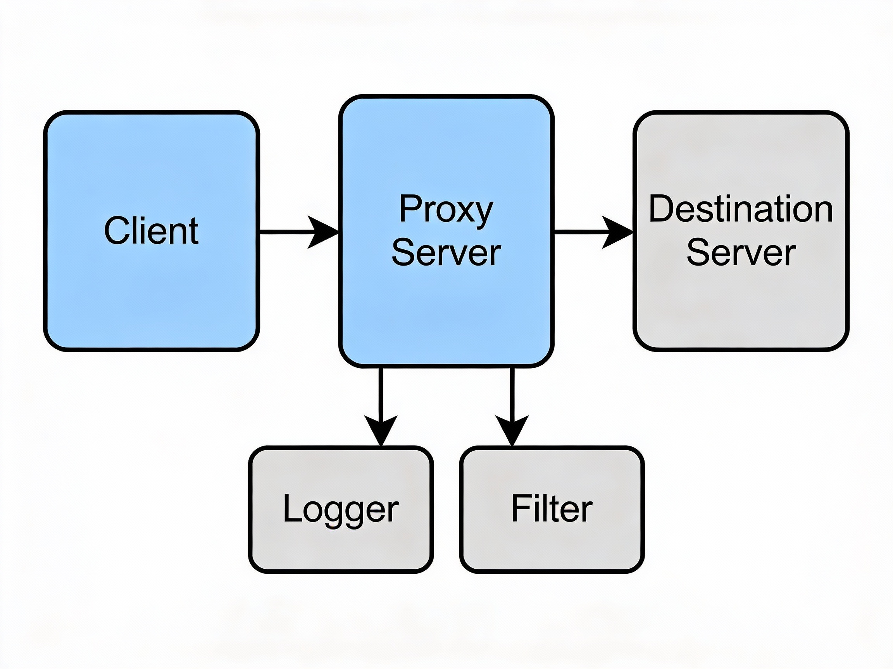

## Architecture Diagram

### Component Description

- Client: Sends HTTP requests to the proxy server.
- Proxy Server: Parses requests, applies filtering rules, forwards allowed requests, and logs activity.
- Destination Server: The actual web server receiving forwarded requests.
- Logger: Records request details and actions taken by the proxy.
- Filter: Blocks requests based on domain/IP rules defined in configuration files.
# Design Document – HTTP Proxy Server
## Concurrency Model

The proxy server uses a thread-per-connection model.
Each incoming client connection is handled by a dedicated thread created after accept().
This approach simplifies request isolation and is suitable for moderate concurrent loads,
which aligns with the academic scope of this project.

## 1. Architecture Overview

This project implements a multi-threaded HTTP proxy server in C++.
The proxy listens on a local port (default: 8888), accepts HTTP requests
from clients, applies filtering rules, forwards valid requests to destination
servers, and relays responses back to the clients.

The design follows a modular architecture to improve readability,
maintainability, and testability.

---

## 2. Module Separation

The system is divided into clearly separated modules:

- **Server Module (server.cpp / server.h)**  
  Responsible for socket creation, listening on a port, accepting client
  connections, and spawning worker threads.

- **HTTP Parsing Module (http_parser.cpp / http_parser.h)**  
  Parses raw HTTP request data and extracts:
  - HTTP method
  - Target host
  - Port number
  - Request path

- **Filtering Module**  
  Reads blocked domains from `config/blocked_domains.txt` and checks
  whether an incoming request should be blocked.

- **Logging Module (logger.cpp / logger.h)**  
  Provides thread-safe logging of requests, blocked attempts, and errors
  into `logs/proxy.log`.

This separation ensures that networking, parsing, filtering, and logging
are independent of each other.

---

## 3. Concurrency Model

The proxy uses a **thread-per-connection** concurrency model.

- Each client connection is handled by a separate worker thread.
- Threads run independently and terminate after request completion.

### Rationale
- Simple and easy to understand
- Suitable for academic projects and moderate traffic
- Demonstrates practical use of multithreading

---

## 4. Request Flow

The lifecycle of a request is as follows:

1. Client sends an HTTP request to the proxy
2. Proxy accepts the connection
3. Raw request data is read from the socket
4. HTTP parser extracts host and port
5. Proxy checks the domain against the blocked list
6. If blocked → return **HTTP 403 Forbidden**
7. If allowed → connect to destination server
8. Forward the request
9. Receive response from server
10. Forward response back to client
11. Log the request and outcome

---

## 5. Configuration & Filtering

- Blocked domains are stored in:
- One domain per line
- The file is loaded at runtime
- If a requested host matches an entry in the file, the request is denied

This design allows easy modification of blocked domains without changing code.

---

## 6. Logging Strategy

- All major events are logged:
- Incoming requests
- Blocked domains
- Forwarded requests
- Errors
- Logs are written to:
- Logging is thread-safe to avoid race conditions in multi-threaded execution

---

## 7. Error Handling

The proxy handles common error scenarios gracefully:

- **400 Bad Request** – malformed HTTP request
- **403 Forbidden** – blocked domain
- **503 Service Unavailable** – destination server unreachable

All sockets are properly closed in case of errors to prevent resource leaks.

---

## 8. Limitations

- HTTPS CONNECT method is not supported
- No caching of responses
- Single request per connection
- IPv4 only
- Not optimized for high-load production environments
## Concurrency Model

The proxy server follows a thread-per-connection concurrency model.
For each incoming client connection accepted by the server socket,
a new thread is created to handle the request independently.

This model simplifies implementation and ensures isolation between clients.
It is suitable for moderate concurrent workloads, which matches the academic
scope of this project.
## Error Handling and Limitations

The proxy server performs basic validation of incoming HTTP requests.
Malformed requests or connection failures are handled by safely closing
the connection and logging the error.

Requests targeting blocked domains or IP addresses return an HTTP
403 Forbidden response and are recorded in the log file.

Limitations:
- HTTPS payloads are not inspected or modified.
- Persistent connections are not reused.
- Chunked transfer encoding is forwarded transparently without parsing.

## Error Handling and Limitations

The proxy server handles common error scenarios gracefully. If a requested
domain is present in the blocklist, the server responds with an HTTP 403
Forbidden status. If DNS resolution or connection to the destination server
fails, the proxy returns HTTP 503 Service Unavailable.

Client disconnections and malformed requests are handled by closing the
connection safely without crashing the server. For simplicity, persistent
connections (keep-alive) are not fully supported, and each client request is
handled independently.
